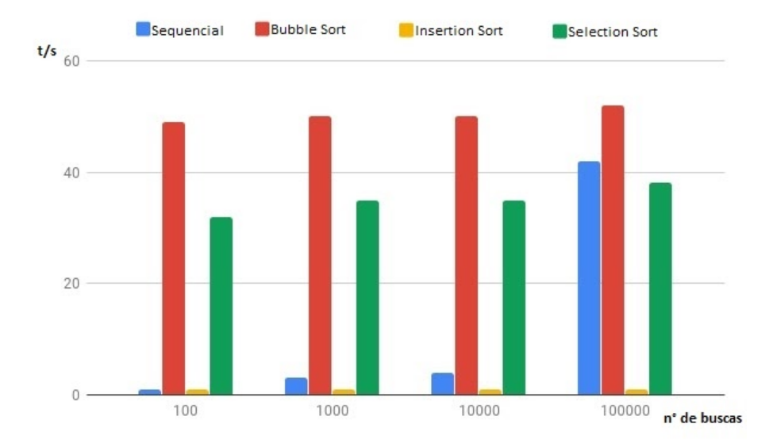
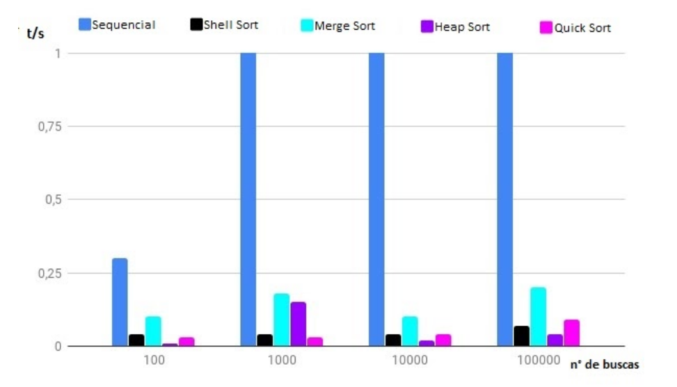

## Busca Binária como Ferramentas Auxiliares de um Sistema de Gerenciamento de Usuários de um Rede Social

#### Este trabalho propõe uma análise de tempo de execução de algoritmos de busca e ordenação com dados de usuários de redes sociais. Foram utilizados algoritmos de busca sequencial e binária com Bubble, Insertion, Selection, Shell, Merge, Heap e Quick. Foi utilizado 100.000 informações e foi verificado que o Busca Sequencial tem um alto tempo de execução com quantidades altas de buscas, diferente do Busca Binária, que combinado com alguns algoritmos de ordenação se torna mais eficiente.

## 1. Introdução

#### Na sociedade vigente, as redes sociais existentes contêm milhões de usuários cadastrados, os quais cada um possui uma série de informações pessoais e todos os dias geram diversos tipos de dados. Através disso, com tantas informações, é necessário realizar buscas por dados de usuários, por exemplo, quando postagens de páginas são compartilhadas somente com seus seguidores. Para realização dessa tarefa, normalmente utiliza-se de algoritmos tradicionais, como os algoritmos de busca sequencial e binária.

#### O algoritmo de busca sequencial tem como característica a comparação de uma dada chave a ser procurada com todas as outras do vetor, entretanto, dependendo da quantidade de buscas ela não é recomendada. Já o algoritmo de busca binária, parte do pressuposto que o vetor já esteja ordenado, e segue o paradigma de divisão e conquista.

#### Esta pesquisa pretende analisar os tempos de processamento em cada caso de busca e verificar qual algoritmo é mais viável em cada uma das situações. Os dados analisados serão de usuários de redes sociais e a partir deles serão utilizados os algoritmos para verificação do tempo de processamento.

## 2. Embasamento Teórico

#### Serão utilizados nesta pesquisa, algoritmos de busca sequencial e binária.

## 2.1 Busca Sequencial

#### De acordo com Ziviani (1999), é o método de pesquisa mais simples que existe e funciona da seguinte maneira: dado uma chave a ser procurada, pesquise sequencialmente até encontrar a chave procurada. Assim que a chave é encontrada ele retorna o índice e a busca é finalizada.

#### Em questões de complexidade de algoritmos, o busca sequencial em seu melhor caso (primeira posição) possui complexidade de O(1), no caso médio O(n/2) e no pior caso (última posição) O(n).

## 2.2 Busca Binária

#### É um método muito mais eficiente se os registros estiverem ordenados. Para encontrar uma determinada chave em um vetor, compare a chave procurada com a do meio do vetor, se a chave é menor então é procurado somente do meio para trás do vetor, e se for maior, do meio para frente. É repetido este processo até que a chave seja encontrada, ou q o vetor fique apenas com uma posição. Sua complexidade é igual em todos os casos O(log n) (ZIVIANI,1999).

## 2.3 Bubble Sort 

#### O Bubble Sort é o algoritmo mais básico para a ordenação, ele funciona passando pelo vetor a ser checado comparando cada par de elementos adjacentes e caso esses elementos estejam na ordem errada eles são trocados. E essa verificação contínua até que não haja mais elementos desordenados no vetor. Ele recebe esse nome, pois todo elemento com o maior valor “flutua” para o topo. A complexidade desse algoritmo é O(n) (FOLADOR, 2014).

## 2.4 Insertion Sort

#### O Insertion Sort ou ordenação por inserção, seu funcionamento é ordenar as chaves e inseri-las na posição ordenada. Os elementos são comparados de dois em dois e o menor é arrastado para trás. Desta maneira, após várias iterações o vetor termina ordenado. Este método é semelhante à organizações de cartas de baralho em uma mão. Sua complexidade no pior caso é O(n2), no melhor caso O(n) e no caso médio caso O(n2), é um algoritmo estável e adaptável (TENEMBAUM; AUGENSTEIN; LANGSAM, 1995).

## 2.5 Selection Sort

#### O Selection Sort assim como o Bubble Sort é um dos métodos de ordenação mais simples existentes. O método de ordenação do Selection Sort funciona de maneira onde se pega o maior elemento da sequência o trocando com o elemento da última posição. E todo esse laço deve ser repetido pelos n-1 elementos, depois pelos n-2 elementos e assim sucessivamente (SIQUEIRA, 1998). A complexidade desse algoritmo é O(n2).

## 2.6 Shell Sort

#### O Shell Sort foi criado em 1959 por Donald Shell, ele foi baseado em uma sequência incremental onde a técnica consiste em tratar um vetor o dividindo em h partes e o ordenando. Dessa forma, ao se quebrar o vetor em partes existe a possibilidade de que essas partes já estejam parcialmente ordenadas. Esse espaçamento escolhido ganha o nome de pivô e esse elemento chave precisa ser o mais aleatório possível. A complexidade do Shell Sort é desconhecida (FOLADOR, 2014).

## 2.7 Merge Sort

#### O Merge Sort é um exemplo de algoritmo de ordenação que usa o conceito de dividir e conquistar. A ideia principal consiste em dividir o vetor em vários sub-vetores menores e resolvê-las usando a recursividade e depois que todas forem resolvidas, a junção delas se torna a resposta para o problema maior. E pelo fato de se utilizar a recursividade para a solução do problema, ela se torna menos eficiente pelo alto consumo de memória e pelo alto tempo de execução. A complexidade do Merge Sort é de O(n log n) (FOLADOR, 2014).

## 2.8 Heap Sort

#### O Heap Sort (ordenação por monte) é um método que utiliza a estrutura de heap. Umaheap é um vetor que representa uma árvore binária completa. Existem dois padrões para se utilizar este método: o min-heap e o max-heap, entretanto o que é mais utilizado é o max-heap, no qual onde o maior elemento se encontra na raiz da heap e os pais são sempre maiores que os filhos. Sua complexidade é de O(n log n) para todos os casos e é um algoritmo não estável, ou seja não pode existir chaves repetidas (CORMEN et al., 2002).

## 2.9 Quick Sort

#### O Quick Sort é um método muito rápido e eficiente, se baseia no paradigma de dividir e conquistar. Consiste em rearranjar as chaves de modo que as menores precedem as maiores. Entretanto a cada chamada recursiva é encontrado um pivô, que é um elemento em sua posição correta na ordenação. No melhor e médio caso, sua complexidade é de O(n log n) e no pior caso O(n2), é um algoritmo não estável e não adaptável (CORMEN et al., 2002).

## 3. Materiais e Métodos

#### Neste trabalho, foram criados algoritmos para criação de um arquivo no formato .dat e também funções para que sejam feitas as verificações de quais métodos de busca são mais eficientes.

#### Para a criação do arquivo .dat foram usadas funções como “FILE *arq” para se criar uma variável do tipo arquivo e várias outras como “fopen” para se abrir o arquivo. Nesse caso, foram criados 100000 linhas de dados contendo informações como ID, Nome, E-mail e Senha. Os ID’s foram gerados aleatoriamente entre 1 e 1000000, não havendo um ID igual a outro. Os nomes foram criados usando uma condição que sorteia a quantidade de caracteres cada nome irá ter, e entre esses caracteres estão presentes as letras de A-Z excluindo os caracteres especiais.

#### Os E-mail’s foram feitos armazenando os dados do nome em uma string e adicionando o prefixo “@e-mail.com” em cada um deles. Enquanto a senha foi criada sorteando a quantidade de caracteres que irá compor a senha (entre 5 e 10) e também fazendo uma checagem para verificar se esse caractere será uma letra ou um número.

## 4. Experimentos Computacionais

#### Na parte da comparação entre os algoritmos de busca sequencial e busca binária, foi utilizado um método para incrementar e verificar quando o tempo gasto do busca sequencial excederia o busca binária mais o algoritmo de ordenação específico. E para coletar o tempo do busca sequencial, busca binária e dos algoritmos de ordenação, foi utilizada a função “gettimeofday”.

#### O computador utilizado para se realizar os experimentos possui o seguinte hardware:

 - i5 4460
 - 8gb de ram
 - Rx 480 de 8gb
 - Ssd de 120gb

 ## 5. Resultados

#### **Gráfico 1**: Resultados do Busca Sequencial e Busca Binária combinada com Bubble Sort, Insertion Sort e Selection Sort.

 

 #### **Gráfico 2**: Resultados do Busca Sequencial e Busca Binária combinada com Shell Sort, Merge Sort, Heap Sort e Quick Sort.

## 6. Conclusão

#### O trabalho teve como principal objetivo fazer uma simulação de um sistema de uma rede social, onde se necessita comparar o tempo de busca sequencial e binária. Uma das maiores dificuldades que tive com o trabalho foram na obtenção do tempo exato utilizado por cada um dos métodos de pesquisa. A função “gettimeofday” se mostrou imprecisa em algumas partes do trabalho, não trazendo assim resultados tão fiéis.

#### No entanto, ainda foi possível se construir gráficos com base nos tempos obtidos. No primeiro gráfico pode-se notar um padrão entre 100, 1000 e 10000 buscas, mas quando são realizadas 100000 buscas o tempo de execução da busca sequencial aumenta bruscamente. Já no segundo gráfico o tempo de execução da busca sequencial é maior em todos os casos de número de buscas, e também com o Shell Sort mantendo a maior estabilidade entre eles.

#### Portanto, a busca sequencial se mostrou bastante viável quando se comparada a algoritmos como o Bubble Sort e o Selection Sort, mas se torna inviável se comparada aos demais.

## 7. Referências

#### CORMEN, Thomas H; RIVEST, Ronald L.; LEISERSON, Charles E; STEIN, Clifford. **Algoritmos: Teoria e Prática**. 2. ed. Rio de Janeiro: Elsevier, 2002.

#### FOLADOR, João Paulo; NETO, Lázaro Nogueira Pena; JORGE, David Calhau. **Aplicativo para análise comparativa do comportamento de algoritmos de ordenação**. Revista Brasileira de Computação Aplicada, v. 6, n. 2, p. 76-86, 2014.

#### TENEMBAUM, Aaron M; AUGENSTEIN, Moshe J; LANGSAM, Yedidyah. **Estrutura de Dados Usando C**. São Paulo: MAKRON Books, 1995.

#### ZIVIANI, Nivio et al. **Projeto de algoritmos: com implementações em Pascal e C**. Luton: Thomson, 2004.

#### SIQUEIRA, Marcelo F. et al. **Algoritmos e Estruturas de Dados I**. Notas de aula, 1998.

